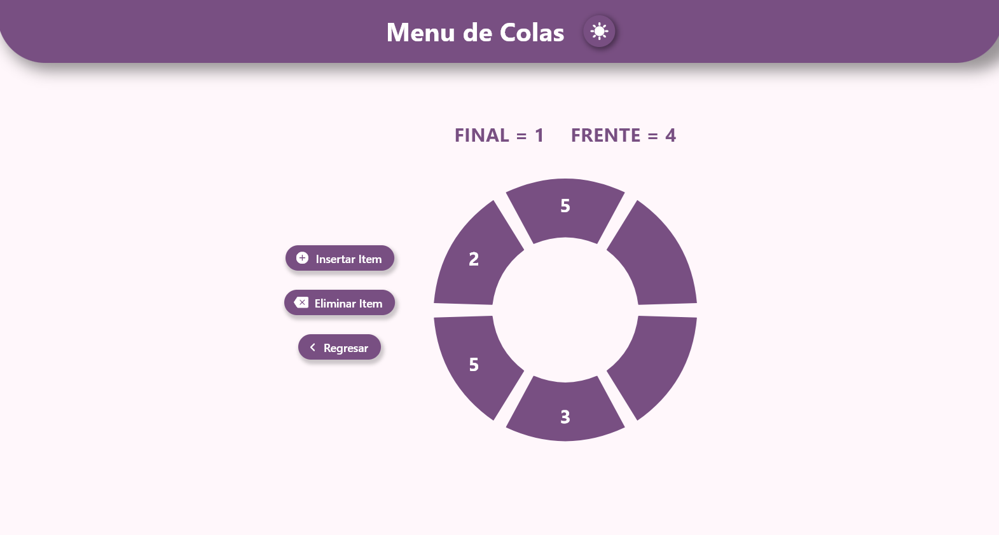

# Data Structures Visualizer

Data Structures Visualizer is a simple project that provides a visual representation of two fundamental data structures: Stack and Queue. The project includes two interactive pages:
1. **Stack Visualizer:** Allows users to add and remove items from a stack with proper error checking.
2. **Queue Visualizer:** Provides a circular representation of a queue, enabling users to add and remove items with proper error checking.

## Table of Contents
- [Features](#features)
- [Demo](#demo)
- [Technologies Used](#technologies-used)

## Features
- **Stack Visualizer:** 
  - Visual representation of a stack.
  - Add items to the stack.
  - Remove items from the stack.
  - Proper error handling for stack overflow and underflow.
- **Queue Visualizer:** 
  - Circular representation of a queue.
  - Add items to the queue.
  - Remove items from the queue.
  - Proper error handling for queue overflow and underflow.

## Demo

## Technologies Used

- Flutter
- Dart

# Author
Alejandro Mendoza - KoiByteDev

